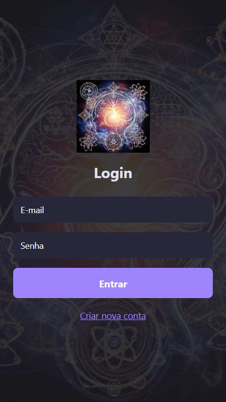
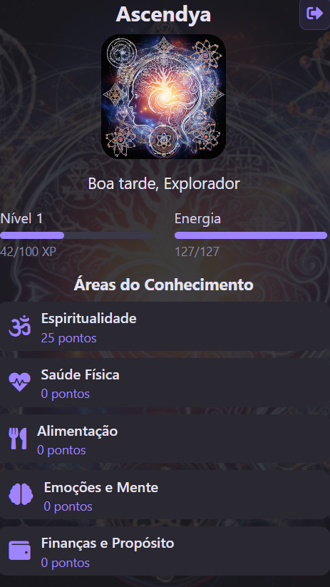
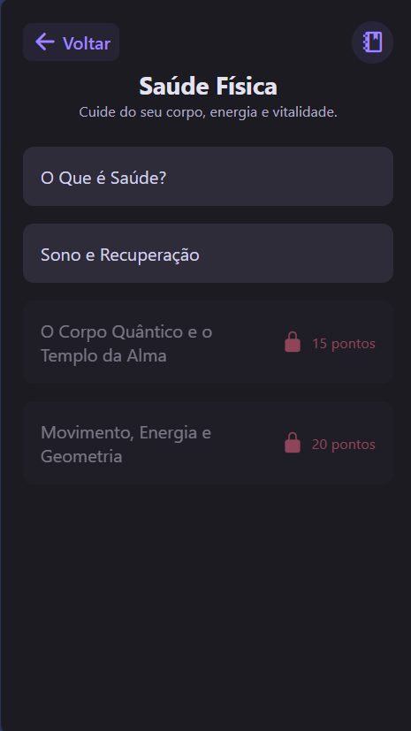
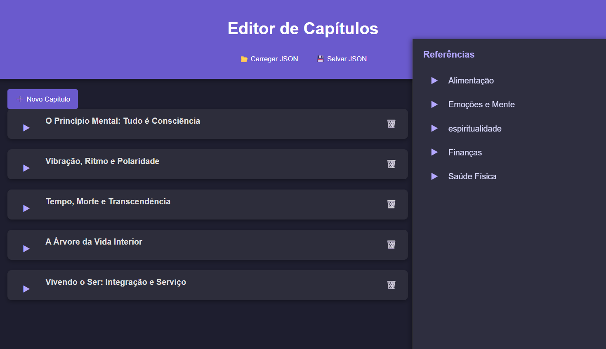
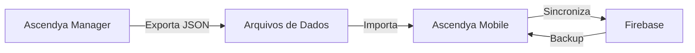

# 🌟 Ascendya - Plataforma de Autodesenvolvimento

<div align="center">


**Transforme sua vida através da gamificação e autoconhecimento**

[](LICENSE)
[](https://reactnative.dev/)
[](https://www.electronjs.org/)
[](https://firebase.google.com/)

[🚀 Demo](#-demonstração) • [📱 Mobile App](#-ascendya-mobile) • [🖥️ Manager](#%EF%B8%8F-ascendya-manager) • [📖 Documentação](#-documentação) • [🤝 Contribuir](#-como-contribuir)

</div>

---

## 📋 Índice

- [Sobre o Projeto](#-sobre-o-projeto)
- [Demonstração](#-demonstração)
- [Arquitetura](#-arquitetura)
- [Ascendya Mobile](#-ascendya-mobile)
- [Ascendya Manager](#%EF%B8%8F-ascendya-manager)
- [Instalação](#-instalação)
- [Uso](#-uso)
- [Estrutura de Dados](#-estrutura-de-dados)
- [Documentação](#-documentação)
- [Como Contribuir](#-como-contribuir)
- [Roadmap](#-roadmap)
- [Licença](#-licença)

---

## 🎯 Sobre o Projeto

**Ascendya** é uma plataforma open-source de autodesenvolvimento que combina **gamificação** com **conteúdo educacional** para promover evolução pessoal em 5 áreas fundamentais da vida:

- 🧘 **Espiritualidade** - Conexão com o eu interior
- 💪 **Saúde Física** - Bem-estar corporal
- 🥗 **Alimentação** - Nutrição consciente
- 🧠 **Emoções e Mente** - Equilíbrio emocional
- 💰 **Finanças e Propósito** - Prosperidade e missão de vida

### Por que Ascendya?

- ✅ **Gamificação Inteligente**: Sistema de XP, níveis, pontos e energia
- ✅ **Conteúdo Profundo**: Baseado em ciência, filosofia e práticas milenares
- ✅ **Totalmente Personalizável**: Crie seu próprio conteúdo
- ✅ **Open Source**: Comunidade ativa e transparente
- ✅ **Multiplataforma**: Android, iOS e Web

---

## 🎬 Demonstração

<details>
<summary><b>📱 Ascendya Mobile - Capturas de Tela</b></summary>

### Tela de Login


### Tela Principal


### Capítulos e Tarefas


### Sistema de Progresso


</details>

<details>
<summary><b>🖥️ Ascendya Manager - Interface</b></summary>

### Editor Principal


### Edição de Capítulos


### Menu de Referências


</details>

---

## 🏗️ Arquitetura

O projeto Ascendya é composto por **dois sistemas integrados**:

```
Ascendya/
├── Ascendya-mobile/      # App mobile (React Native + Expo)
├── Ascendya-manager/     # Editor desktop (Electron)
└── README.md             # Este arquivo
```

### Fluxo de Dados



---

## 📱 Ascendya Mobile

<details open>
<summary><b>Visão Geral</b></summary>

Aplicativo mobile multiplataforma (Android/iOS/Web) para jornada de autodesenvolvimento gamificada.

### ✨ Funcionalidades Principais

- 🔐 **Autenticação**: Login/Cadastro via Firebase
- 📚 **Áreas de Conhecimento**: 5 trilhas temáticas completas
- 📖 **Capítulos Educacionais**: Conteúdo rico com textos, imagens e referências
- ✅ **Tarefas Práticas**: Atividades para aplicar o conhecimento
- 💬 **Feedbacks Reflexivos**: Perguntas para consolidar aprendizado
- 📝 **Anotações Pessoais**: Sistema de notas por capítulo
- 📊 **Sistema de Progresso**: XP, níveis, pontos por área e energia
- 🔄 **Sincronização**: Dados salvos localmente e no Firebase
- 📱 **Responsivo**: Adaptado para mobile e web

### 🛠️ Tecnologias

- **Framework**: React Native 0.76 + Expo 52
- **Navegação**: React Navigation 7
- **Backend**: Firebase (Auth + Firestore)
- **Storage Local**: AsyncStorage
- **Ícones**: Expo Vector Icons (FontAwesome5)
- **Linguagem**: JavaScript (ES6+)

</details>

<details>
<summary><b>🚀 Instalação e Execução</b></summary>

### Pré-requisitos

- Node.js 18+ e npm
- Expo CLI (instalado automaticamente)
- Conta Firebase (para autenticação)

### Passo a Passo

1. **Clone o repositório**
   ```bash
   git clone https://github.com/seu-usuario/ascendya.git
   cd ascendya/Ascendya-mobile
   ```

2. **Instale as dependências**
   ```bash
   npm install
   ```

3. **Configure o Firebase**
   - Crie um projeto no [Firebase Console](https://console.firebase.google.com/)
   - Ative Authentication (Email/Password)
   - Ative Firestore Database
   - Copie as credenciais para `firebaseConfig.js`

4. **Execute o projeto**
   ```bash
   npm run start
   ```

5. **Escolha a plataforma**
   - Pressione `w` para abrir no navegador
   - Pressione `a` para Android (requer emulador/dispositivo)
   - Pressione `i` para iOS (requer macOS + Xcode)

</details>

<details>
<summary><b>📂 Estrutura do Projeto</b></summary>

```
Ascendya-mobile/
├── App.js                    # Componente raiz
├── screens/                  # Telas do app
│   ├── HomeScreen.js         # Tela principal
│   ├── ChapterScreen.js      # Lista de capítulos
│   ├── TaskScreen.js         # Conteúdo e tarefas
│   ├── LoginScreen.js        # Autenticação
│   └── ...
├── components/               # Componentes reutilizáveis
│   ├── ButtonPrimary.js
│   ├── ProgressBar.js
│   └── ...
├── context/                  # Context API
│   └── UserContext.js        # Estado global do usuário
├── public/
│   ├── data/                 # Arquivos JSON de conteúdo
│   │   ├── espiritualidade.json
│   │   ├── saude_fisica.json
│   │   └── ...
│   └── assets/               # Imagens e recursos
├── utils/                    # Utilitários
│   └── imagesLocalData.js    # Registro de imagens
├── firebaseConfig.js         # Configuração Firebase
└── package.json
```

</details>

<details>
<summary><b>🎮 Sistema de Gamificação</b></summary>

### XP (Experiência)
- Ganho ao completar tarefas
- Acumula para subir de nível
- Cada nível requer 100 XP

### Pontos por Área
- Cada área tem pontuação separada
- Mostra progresso específico em cada trilha
- Desbloqueia capítulos avançados

### Energia
- Tarefas físicas gastam energia
- Tarefas mentais podem restaurar energia
- Máximo: 100 pontos

### Níveis
- Nível inicial: 1
- Aumenta a cada 100 XP
- Desbloqueia conteúdos exclusivos

</details>

---

## 🖥️ Ascendya Manager

<details open>
<summary><b>Visão Geral</b></summary>

Aplicação desktop (Electron) para **criar, editar e gerenciar** todo o conteúdo do Ascendya Mobile de forma visual e intuitiva.

### ✨ Funcionalidades Principais

- 📝 **Editor Visual**: Interface gráfica para edição de JSON
- ➕ **Criar Capítulos**: Adicione novos capítulos com facilidade
- 📑 **Gerenciar Tópicos**: Organize conteúdo em seções
- ✅ **Configurar Tarefas**: Defina XP, pontos, energia e tipo
- 🖼️ **Adicionar Imagens**: Upload automático e referência
- 🔗 **Referências Cruzadas**: Conecte capítulos entre áreas
- 💬 **Feedbacks**: Configure perguntas reflexivas
- 💾 **Exportar JSON**: Salve tudo em formato padronizado
- 🗂️ **Menu Lateral**: Navegação hierárquica por todas as áreas

### 🛠️ Tecnologias

- **Framework**: Electron 36.5
- **Interface**: HTML + CSS + JavaScript Vanilla
- **File System**: Node.js FS API
- **Arquitetura**: Main Process + Renderer Process

</details>

<details>
<summary><b>🚀 Instalação e Execução</b></summary>

### Pré-requisitos

- Node.js 18+ e npm

### Passo a Passo

1. **Navegue até a pasta do manager**
   ```bash
   cd ascendya/Ascendya-manager
   ```

2. **Instale as dependências**
   ```bash
   npm install
   ```

3. **Execute o aplicativo**
   ```bash
   npm run dev
   ```

Uma janela do Electron será aberta com o **Editor de Capítulos**.

</details>

<details>
<summary><b>📖 Como Usar o Manager</b></summary>

### 1️⃣ Carregar um Arquivo JSON

1. Clique em **📂 Carregar JSON**
2. Selecione um arquivo da pasta `data/`:
   - `espiritualidade.json`
   - `saude_fisica.json`
   - `alimentacao.json`
   - `emocoes.json`
   - `financas.json`

### 2️⃣ Criar um Novo Capítulo

1. Clique em **➕ Novo Capítulo**
2. Preencha:
   - **Título**: Nome do capítulo
   - **Descrição**: Resumo do conteúdo
3. O ID é gerado automaticamente

### 3️⃣ Adicionar Tópicos

1. Dentro de um capítulo, clique em **➕ Novo Tópico**
2. Preencha:
   - **Título do Tópico**: Ex: "🧘 O Que é Meditação?"
   - **Conteúdo**: Parágrafos separados por duas quebras de linha

**Exemplo de conteúdo:**
```
A meditação é uma prática milenar.

Ela ajuda a acalmar a mente e reduzir o estresse.

Existem diversos tipos de meditação.
```

### 4️⃣ Adicionar Imagens

1. No tópico desejado, clique em **🖼️ Adicionar Imagem**
2. Selecione a imagem do seu computador
3. A imagem será:
   - Salva em `images/`
   - Nomeada como `{id_capitulo}_image_{numero}.png`
   - Referenciada automaticamente no JSON

### 5️⃣ Criar Referências Cruzadas

1. Clique no campo de **Conteúdo do Tópico**
2. Na **sidebar direita**, navegue até: Área → Capítulo → Tópico
3. Clique no tópico desejado
4. A referência é inserida automaticamente:

```json
{
  "referencia": {
    "area": "Saúde Física",
    "capituloId": "saude_1",
    "texto": "Referência ao tópico \"Respiração Consciente\""
  }
}
```

### 6️⃣ Adicionar Tarefas

1. Clique em **➕ Nova Tarefa**
2. Preencha:
   - **Descrição**: "Pratique 10 minutos de meditação"
   - **XP**: 15
   - **Pontos**: 10
   - **Energia**: 5
   - **Tipo**: `mental`, `fisica`, `respiracao`, `reflexiva`, `espiritual`, `proposito`

### 7️⃣ Configurar Feedback

1. Clique em **➕ Feedback**
2. Marque **Ativo**
3. Adicione perguntas:
   - "Como foi a experiência?"
   - "O que você aprendeu?"

### 8️⃣ Salvar Alterações

1. Clique em **💾 Salvar JSON**
2. O arquivo é salvo em `data/`

</details>

<details>
<summary><b>🔄 Sincronizar com o Mobile</b></summary>

### Passo 1: Copiar Arquivos JSON

Copie os arquivos JSON de:
```
Ascendya-manager/data/
```

Para:
```
Ascendya-mobile/public/data/
```

### Passo 2: Copiar Imagens

Copie as imagens de:
```
Ascendya-manager/images/
```

Para:
```
Ascendya-mobile/public/assets/images/
```

### Passo 3: Registrar Imagens

Abra: `Ascendya-mobile/utils/imagesLocalData.js`

Adicione as novas imagens:
```javascript
export const imagens = {
  'Logo.png': require('../public/assets/images/Logo.png'),
  'espiritualidade_2_image_1.png': require('../public/assets/images/espiritualidade_2_image_1.png'),
  // Adicione suas novas imagens aqui
};
```

### Passo 4: Recarregar o App

O Metro bundler detectará as mudanças automaticamente.

</details>

---

## 📦 Instalação

<details>
<summary><b>Instalação Rápida</b></summary>

```bash
# Clone o repositório
git clone https://github.com/seu-usuario/ascendya.git
cd ascendya

# Instale dependências do Mobile
cd Ascendya-mobile
npm install

# Instale dependências do Manager
cd ../Ascendya-manager
npm install
```

</details>

---

## 🎯 Uso

<details>
<summary><b>Para Usuários Finais</b></summary>

### Usando o App Mobile

1. **Baixe o app** (quando disponível nas lojas)
2. **Crie uma conta** com email e senha
3. **Escolha uma área** para começar
4. **Leia os capítulos** e complete as tarefas
5. **Ganhe XP e pontos** para evoluir
6. **Faça anotações** para registrar insights

### Dicas

- Complete tarefas diariamente para manter o progresso
- Use as referências cruzadas para aprofundar tópicos
- Responda aos feedbacks com honestidade
- Revise suas anotações periodicamente

</details>

<details>
<summary><b>Para Criadores de Conteúdo</b></summary>

### Criando Conteúdo no Manager

1. **Abra o Ascendya Manager**
2. **Carregue um arquivo JSON** existente
3. **Crie novos capítulos** ou edite existentes
4. **Adicione tópicos** com conteúdo rico
5. **Insira imagens** para ilustrar conceitos
6. **Configure tarefas** práticas
7. **Salve e sincronize** com o mobile

### Boas Práticas

- Use emojis nos títulos para deixar visual
- Separe parágrafos com duas quebras de linha
- Mantenha parágrafos curtos e objetivos
- Use referências para conectar conceitos
- Balance XP/Pontos/Energia de forma justa

</details>

<details>
<summary><b>Para Desenvolvedores</b></summary>

### Configurando Ambiente de Desenvolvimento

1. **Clone o repositório**
2. **Configure Firebase** (veja seção Mobile)
3. **Instale dependências** de ambos os projetos
4. **Execute em modo dev**:
   ```bash
   # Mobile
   cd Ascendya-mobile
   npm run start
   
   # Manager
   cd Ascendya-manager
   npm run dev
   ```

### Estrutura de Branches

- `main` - Produção estável
- `develop` - Desenvolvimento ativo
- `feature/*` - Novas funcionalidades
- `fix/*` - Correções de bugs

### Workflow de Contribuição

1. Fork o repositório
2. Crie uma branch: `git checkout -b feature/minha-feature`
3. Commit: `git commit -m 'feat: adiciona nova feature'`
4. Push: `git push origin feature/minha-feature`
5. Abra um Pull Request

</details>

---

## 📊 Estrutura de Dados

<details>
<summary><b>Formato JSON dos Capítulos</b></summary>

```json
{
  "area": "Espiritualidade",
  "icone": "spa",
  "cor": "#a280f7",
  "descricao": "Desvende a realidade além da matéria.",
  "capitulos": [
    {
      "id": "espiritualidade_1",
      "titulo": "O Princípio Mental",
      "descricao": "Tudo é consciência",
      "topicos": [
        {
          "titulo": "🧿 A Mente Una",
          "conteudo": [
            "Parágrafo 1...",
            "Parágrafo 2...",
            {"imagem": "espiritualidade_1_image_1.png"},
            {
              "referencia": {
                "area": "Saúde Física",
                "capituloId": "saude_1",
                "texto": "Veja também: Respiração"
              }
            }
          ]
        }
      ],
      "tarefas": [
        {
          "id": "tarefa_1",
          "descricao": "Pratique 5 minutos de meditação",
          "xp": 10,
          "pontos": 5,
          "energia": 4,
          "tipo": "mental"
        }
      ],
      "feedback": {
        "ativo": true,
        "perguntas": [
          "Como foi a experiência?",
          "O que você aprendeu?"
        ]
      },
      "pontosMinimos": 0
    }
  ]
}
```

</details>

<details>
<summary><b>Tipos de Tarefa</b></summary>

| Tipo | Descrição | Exemplo |
|------|-----------|---------|
| `mental` | Meditação, visualização | Meditar 10 minutos |
| `fisica` | Exercícios, movimento | Caminhar 30 minutos |
| `respiracao` | Práticas respiratórias | Respiração 4-4-4-4 |
| `reflexiva` | Escrita, journaling | Escrever 3 gratidões |
| `espiritual` | Práticas espirituais | Oração ou mantra |
| `proposito` | Ações com propósito | Ajudar alguém |

</details>

---

## 📖 Documentação

### Documentação do Mobile
- [Documentação Técnica](./Ascendya-mobile/docs/documentacao-tecnica.md)
- [Estrutura de Dados](./Ascendya-mobile/docs/estrutura-dados.md)
- [Guia de Contribuição](./Ascendya-mobile/docs/guia-contribuicao.md)

### Documentação do Manager
- [Visão Geral](./Ascendya-manager/docs/visao_geral.md)
- [Guia do Usuário](./Ascendya-manager/docs/guia_usuario.md)
- [Estrutura de Dados](./Ascendya-manager/docs/estrutura_dados.md)
- [Fluxo da Aplicação](./Ascendya-manager/docs/fluxo_aplicacao.md)
- [Desenvolvimento](./Ascendya-manager/docs/desenvolvimento.md)

---

## 🤝 Como Contribuir

Contribuições são muito bem-vindas! Veja como você pode ajudar:

<details>
<summary><b>Reportar Bugs</b></summary>

1. Verifique se o bug já foi reportado nas [Issues](https://github.com/seu-usuario/ascendya/issues)
2. Se não, abra uma nova issue com:
   - Descrição clara do problema
   - Passos para reproduzir
   - Comportamento esperado vs atual
   - Screenshots (se aplicável)
   - Ambiente (OS, versão do app, etc.)

</details>

<details>
<summary><b>Sugerir Funcionalidades</b></summary>

1. Abra uma issue com a tag `enhancement`
2. Descreva a funcionalidade desejada
3. Explique o caso de uso
4. Proponha uma solução (opcional)

</details>

<details>
<summary><b>Contribuir com Código</b></summary>

1. **Fork** o repositório
2. **Clone** seu fork: `git clone https://github.com/seu-usuario/ascendya.git`
3. **Crie uma branch**: `git checkout -b feature/minha-feature`
4. **Faça suas alterações** seguindo o padrão de código
5. **Teste** localmente
6. **Commit**: `git commit -m 'feat: adiciona nova feature'`
7. **Push**: `git push origin feature/minha-feature`
8. **Abra um Pull Request** detalhando suas mudanças

### Padrão de Commits

Usamos [Conventional Commits](https://www.conventionalcommits.org/):

- `feat:` - Nova funcionalidade
- `fix:` - Correção de bug
- `docs:` - Documentação
- `style:` - Formatação
- `refactor:` - Refatoração
- `test:` - Testes
- `chore:` - Manutenção

</details>

<details>
<summary><b>Contribuir com Conteúdo</b></summary>

1. Use o **Ascendya Manager** para criar/editar conteúdo
2. Siga as boas práticas de escrita
3. Adicione referências bibliográficas
4. Teste no app mobile
5. Abra um PR com os arquivos JSON

</details>

---

## 🗺️ Roadmap

### ✅ Concluído
- [x] App mobile funcional (Android/iOS/Web)
- [x] Sistema de autenticação Firebase
- [x] Editor desktop (Manager)
- [x] 5 áreas de conhecimento
- [x] Sistema de gamificação
- [x] Sincronização de dados

### 🚧 Em Desenvolvimento
- [ ] Novos conteúdos
- [ ] Novos tipos de tarefas

### 🔮 Futuro
- [ ] Comunidade integrada
- [ ] Desafios semanais
- [ ] Ranking global
- [ ] IA para recomendações personalizadas

---

## 👥 Equipe

<table>
  <tr>
    <td align="center">
      <a href="https://github.com/Shepardy22">
        
        <br />
        <sub><b>Shepardy</b></sub>
      </a>
      <br />
      <sub>Criador</sub>
    </td>
  </tr>
</table>

---

## 📄 Licença

Este projeto está sob a licença MIT. Veja o arquivo [LICENSE](LICENSE) para mais detalhes.

---


<div align="center">

⭐ Se este projeto te ajudou, considere dar uma estrela!

[⬆ Voltar ao topo](#-ascendya---plataforma-de-autodesenvolvimento)

</div>
